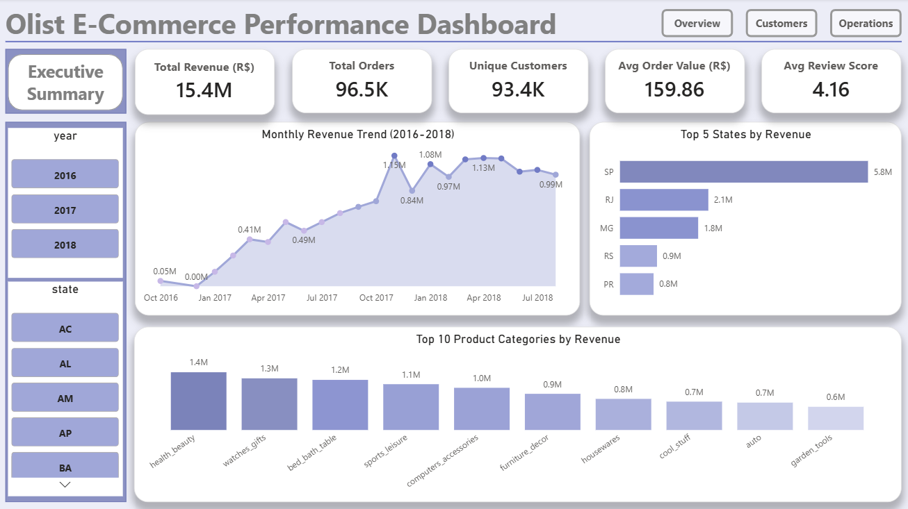
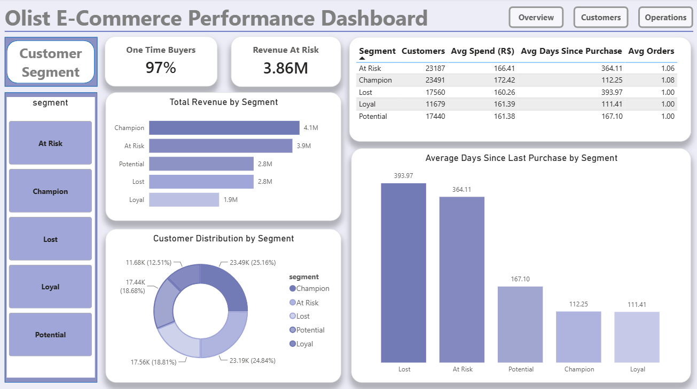
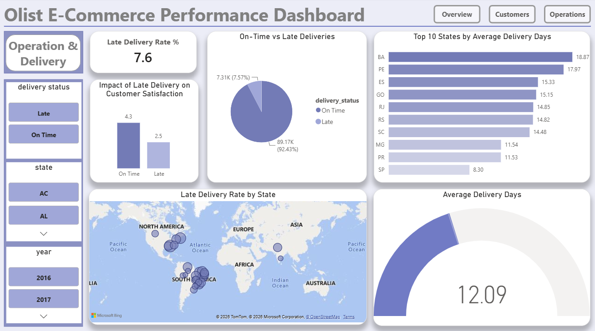

# 🛒 Olist E-Commerce Customer Analysis
### End-to-end data analytics project using Python, PostgreSQL and Power BI


---

## 🛠️ Skills Demonstrated
`Python` `Pandas` `Data Cleaning` `Exploratory Data Analysis` `PostgreSQL` `SQL` `Power BI` `DAX` `Data Visualization` `RFM Segmentation` `Customer Analytics` `Business Analysis`

---

## 📌 Problem Statement
Olist is a Brazilian e-commerce platform connecting sellers to customers.
Despite strong revenue growth, **97% of customers never placed a second order.**
This project analyses 100,000+ orders to identify customer retention gaps,
logistics bottlenecks, and high-value customer segments worth targeting.

---

## 🔍 Key Findings
| # | Finding |
|---|---------|
| 1 | Revenue grew **10x from R$8K/month (2016) to R$1M+/month (2018)** |
| 2 | **Health & Beauty** is the #1 revenue category (R$1.4M+) |
| 3 | Only **3% of customers are repeat buyers** — 97% bought once and never returned |
| 4 | **Champions segment drives 41% of total revenue** despite being 25% of users |
| 5 | **Late deliveries reduce review scores from 4.3 to 2.5** — a 42% satisfaction drop |
| 6 | **Alagoas (AL)** has the highest late delivery rate among all Brazilian states |
| 7 | **R$3.86M revenue at risk** from the At Risk customer segment |
| 8 | **November 2017** was peak revenue month — Black Friday effect confirmed |

---

## 📊 Dashboard Preview

### Executive Summary


### Customer Segments


### Operations & Delivery


---

## 🛠️ Tools & Technologies
| Tool | Purpose |
|------|---------|
| Python (pandas, matplotlib, seaborn) | Data cleaning, merging, EDA |
| PostgreSQL | Data storage and KPI queries |
| Power BI + DAX | Interactive 4-page dashboard |
| Jupyter Notebook | Analysis and documentation |

---

## 📁 Project Structure
```
olist-ecommerce-analysis/
├── notebooks/
│   ├── 01_data_merge_cleaning.ipynb
│   ├── 02_eda_insights.ipynb
│   ├── 03_rfm_segmentation.ipynb
│   └── 04_load_to_postgresql.ipynb
├── sql/
│   └── analysis_queries.sql
├── assets/
│   └── dashboard screenshots
└── README.md
```

---

## 📋 Methodology

### 1️⃣ Data Merging
Merged 9 relational CSV tables using pandas — equivalent to multi-table SQL JOINs across 100,000+ records. Created derived columns: delivery_days, late_delivery, order_month, RFM scores.

### 2️⃣ Exploratory Data Analysis
- Monthly revenue trend analysis
- Top 10 product categories by revenue
- Late delivery rate by state
- Review score distribution

### 3️⃣ RFM Segmentation
Built RFM model to segment 93,357 customers into 5 groups:

| Segment | Customers | Avg Spend | Avg Days Since Purchase |
|---------|-----------|-----------|------------------------|
| Champion | 23,491 | R$172 | 112 days |
| Loyal | 11,679 | R$161 | 111 days |
| Potential | 17,440 | R$161 | 167 days |
| At Risk | 23,187 | R$166 | 364 days |
| Lost | 17,560 | R$160 | 394 days |

### 4️⃣ SQL Analysis (PostgreSQL)
Wrote 8 KPI queries covering MoM revenue growth, repeat purchase rate, late delivery impact, and segment revenue breakdown.

**Example query — Month over Month Revenue:**
```sql
SELECT
    DATE_TRUNC('month', order_purchase_timestamp) AS month,
    ROUND(SUM(payment_value)::numeric, 2) AS revenue,
    COUNT(DISTINCT order_id) AS total_orders
FROM orders
GROUP BY month
ORDER BY month;
```

**Example query — Late Delivery Impact:**
```sql
SELECT
    late_delivery,
    COUNT(*) AS orders,
    ROUND(AVG(review_score)::numeric, 2) AS avg_review
FROM orders
GROUP BY late_delivery;
```

### 5️⃣ Power BI Dashboard (4 pages)
- **Main Dashboard** — Navigation hub with buttons
- **Executive Summary** — Revenue KPIs, trends, top categories
- **Customer Segments** — RFM analysis, retention metrics
- **Operations & Delivery** — Late delivery analysis, state performance

---

## ⚡ Challenges Faced
- **Merging 9 relational datasets** — handled using sequential pandas merges on order_id and customer_id keys
- **Handling missing values** — dropped nulls in payment_value, imputed review scores
- **Creating RFM scores** — used pandas qcut for quartile-based scoring with rank() to handle ties
- **Boolean column in Power BI** — late_delivery True/False required custom column transformation
- **Designing Power BI relationships** — connected olist_master and rfm_segments tables correctly

---

## 💡 Business Recommendations
1. **Target At Risk segment** with re-engagement campaigns — R$3.86M revenue at stake
2. **Fix North-East logistics** — AL, BA, ES have worst delivery performance
3. **Reward Champions** with loyalty program — they drive 41% of revenue
4. **Invest in Health & Beauty** — #1 revenue category with growth potential

---

## ▶️ How to Run
1. Download Olist dataset from [Kaggle](https://www.kaggle.com/datasets/olistbr/brazilian-ecommerce)
2. Place 9 CSV files in `data/raw/`
3. Run notebooks in order: `01 → 02 → 03 → 04`
4. Open `powerbi/olist_dashboard.pbix` in Power BI Desktop

---

## 📂 Dataset
- **Source:** [Brazilian E-Commerce Public Dataset by Olist](https://www.kaggle.com/datasets/olistbr/brazilian-ecommerce)
- **Size:** 100,000+ orders across 9 relational tables
- **Period:** October 2016 – August 2018

---

*📍 Built by Tanisha Ramteke | Data Analytics Portfolio Project | 2026*
